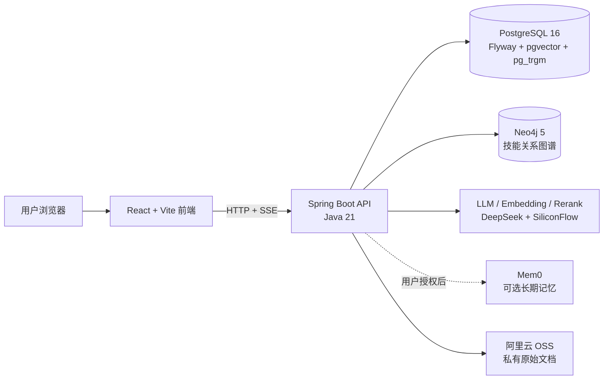
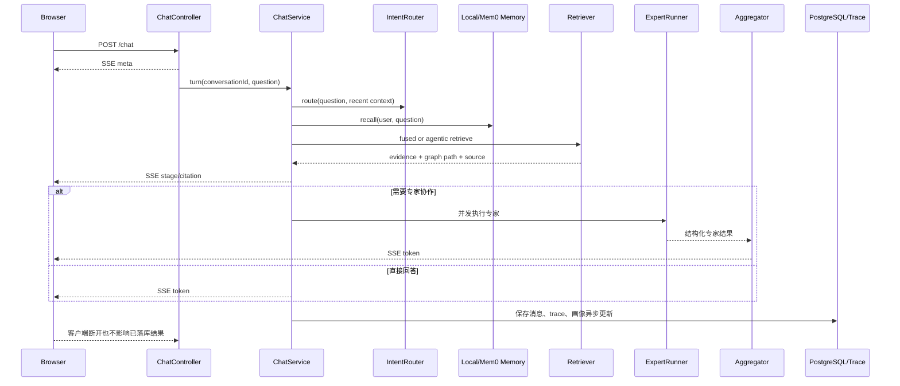

# 项目架构

## 1. 项目目标

项目面向个人求职和学习场景，将以下链路串成闭环：

```text
目标岗位 / 用户问题
        ↓
意图路由与用户上下文
        ↓
向量 + 关键词 + 图谱检索
        ↓
专家并发 / 直接回答 / 多跳检索
        ↓
结果仲裁、引用和 SSE 输出
        ↓
画像更新、学习任务、岗位推送和评测留痕
```

核心工程目标不是让 LLM 自由调用更多工具，而是让每次调用都具备明确的 Query 类型、有限候选范围、可解释证据、故障边界和可回归指标。

## 2. 组件关系



| 组件 | 职责 | 失败时的处理 |
| --- | --- | --- |
| React/Vite | 页面、SSE 消费、评测可视化、管理员操作 | 展示用户友好错误，不暴露堆栈 |
| Spring Boot | 认证、会话、Agent 编排、业务 API | 按模块超时、降级并记录 trace |
| PostgreSQL | 业务数据、会话、任务、文档分块、向量和评测结果 | 主业务依赖，未就绪时 `/readyz` 返回 503 |
| Neo4j | 技能前置关系和有限图扩展 | 熔断后返回安全空结果，主流程继续 |
| LLM 服务 | 路由、总结、专家回答、Embedding、Rerank | 超时/失败时按调用目的回退 |
| Mem0 | 可选跨会话长期记忆 | 本地 Episode 记忆兜底，不阻断聊天 |
| OSS | 知识库原始文件 | 上传失败不写入成功状态，处理失败可重试 |

## 3. 聊天请求时序



当前 SSE 事件包括：`meta`、`stage`、`clarify`、`citation`、`token`、`done`、`error`。Token 携带 `seq`，引用携带 `sid`，前端据此进行顺序拼接和证据展示。

### 3.1 当前系统详细时序图

下面的图对应当前 Java 代码的实际职责边界。聊天默认走流式回答；当
`CHAT_TOOL_LOOP_ENABLED=true` 时，直答路径会先尝试受控 JSON 工具循环，失败后回退到原有 SSE 流。

```mermaid
sequenceDiagram
    autonumber
    actor User as 用户
    participant Browser as React 前端
    participant Auth as AuthInterceptor<br/>JWT Cookie + CSRF
    participant ChatC as ChatController
    participant ChatS as ChatService
    participant Router as IntentRouter<br/>RoutingPolicy
    participant Profile as ProfileService
    participant Memory as Local Memory<br/>Episode / Mem0
    participant Retrieve as FusedRetriever<br/>AgenticRetriever
    participant PG as PostgreSQL<br/>会话 / 画像 / 任务 / Trace
    participant Neo as Neo4j<br/>技能图谱
    participant Loop as ToolCallLoop<br/>可选
    participant Registry as ToolRegistry
    participant Exec as ToolExecutor
    participant Tool as 受控业务工具
    participant LLM as LlmGateway<br/>DeepSeek / SiliconFlow
    participant Expert as ExpertRunner
    participant Agg as Aggregator
    participant Trace as TraceRecorder
    participant Async as 异步任务池

    User->>Browser: 输入问题并点击发送
    Browser->>ChatC: POST /chat<br/>conversationId + question
    ChatC->>Auth: 校验 tutor_access Cookie
    Auth-->>ChatC: 注入 userId / tenantId
    ChatC-->>Browser: SSE meta<br/>conversationId + traceId
    ChatC->>ChatS: turn(conversationId, question, events, cancellation)

    ChatS->>PG: 读取会话、最近历史和摘要
    PG-->>ChatS: history + summary
    ChatS->>Profile: snapshot(userId)
    Profile->>PG: 读取画像、技能和待确认字段
    PG-->>Profile: profile snapshot
    Profile-->>ChatS: 用户画像
    ChatS->>Memory: recall(userId, question)
    alt Mem0 已授权且熔断器关闭
        Memory->>LLM: 受限长期记忆请求
        LLM-->>Memory: 记忆结果
    else Mem0 未授权 / 超时 / 熔断
        Memory-->>ChatS: 本地 Episode 记忆兜底
    end

    ChatS->>Router: routeDecision(question, recent context)
    Router-->>ChatS: intent + scope + confidence + reasonCodes
    ChatS->>Router: routingPolicy.plan(decision, question)
    Router-->>ChatS: execution plan<br/>facets / skipRetrieval / experts

    alt 越界或无需检索
        ChatS-->>Browser: SSE stage(out_of_scope / direct)
    else 需要证据
        ChatS-->>Browser: SSE stage(retrieving)
        ChatS->>Retrieve: retrieve(question, topK, traceId, scope)
        Retrieve->>LLM: query embedding
        LLM-->>Retrieve: vector query embedding
        Retrieve->>PG: pgvector Top20
        PG-->>Retrieve: dense candidates
        Retrieve->>PG: pg_trgm sparse search
        PG-->>Retrieve: sparse candidates
        Retrieve->>Neo: 白名单关系一跳扩展
        Neo-->>Retrieve: graph neighbors
        Retrieve->>Retrieve: RRF 融合、去重、图分数衰减
        opt 资源推荐或配置要求重排
            Retrieve->>LLM: rerank candidate pool
            LLM-->>Retrieve: rerank scores
        end
        Retrieve-->>ChatS: TopK Evidence<br/>source + graph path + citation ids
        ChatS-->>Browser: SSE citation<br/>证据列表和来源状态
    end

    alt 需要专家协作
        ChatS->>Expert: run(experts, briefing, traceId, cancellation)
        par 简历专家
            Expert->>LLM: Purpose.EXPERT structured JSON
            LLM-->>Expert: resume advice + citations
        and 学习规划专家
            Expert->>LLM: Purpose.EXPERT structured JSON
            LLM-->>Expert: weekly plan + citations
        and 面试专家
            Expert->>LLM: Purpose.EXPERT structured JSON
            LLM-->>Expert: questions + citations
        end
        Expert->>Expert: schema / size / confidence / citation validation
        Expert-->>ChatS: valid expert outputs<br/>failed experts treated as absent
        ChatS->>Agg: aggregate(question, evidence, expert outputs)
        Agg->>LLM: Purpose.CHAT aggregation
        LLM-->>Agg: answer stream
        Agg-->>Browser: SSE stage + token
    else 直接回答
        ChatS->>ChatS: assemble prompt<br/>profile + evidence + history + memory
        alt CHAT_TOOL_LOOP_ENABLED=true
            ChatS->>Loop: run(Purpose.CHAT, messages, context)
            Loop->>LLM: chatJson(strict JSON protocol)
            LLM-->>Loop: tool_call or final
            loop 最多 3 步
                alt type=tool_call
                    Loop->>Registry: resolve(tool name)
                    Registry-->>Loop: ToolRegistration + input schema
                    Loop->>Exec: executeJson(tool, arguments, context)
                    Exec->>Registry: permission + schema + side-effect check
                    Registry-->>Exec: allowed / rejected
                    Exec->>PG: claim idempotency key<br/>L1/L2 only
                    Exec->>Tool: execute with timeout
                    Tool-->>Exec: result or failure
                    Exec->>PG: tool_calls audit<br/>args digest + status + duration
                    Exec-->>Loop: bounded tool result
                    Loop->>LLM: tool result as untrusted data
                    LLM-->>Loop: next tool_call or final
                else type=final
                    Loop-->>ChatS: final answer
                end
            end
            alt 工具循环失败 / 步数超限 / 输出非法
                Loop-->>ChatS: error
                ChatS->>LLM: 回退到普通 chatStream
            end
        else 默认流式直答
            ChatS->>LLM: chatStream(Purpose.CHAT, messages)
            LLM-->>ChatS: streaming tokens
        end
        ChatS-->>Browser: SSE token(seq, text)
    end

    ChatS->>ChatS: citation guard<br/>解析 [S#] 并校验来源
    ChatS->>PG: append assistant message<br/>citations + citation_status + trace_id
    ChatS-->>Browser: SSE done(messageId, citationStatus)

    par 请求完成后的异步工作
        ChatS->>Async: postTurnTasks.submit
        Async->>Profile: updateFromMessage(userId, question, answer)
        Profile->>PG: 写入画像变更事件
        Async->>Memory: episode summarization / outbox sync
        Memory->>PG: 保存摘要、租约和 outbox
        ChatS->>Trace: record turn trace
        Trace->>PG: 异步写入 turn_traces
        ChatS->>PG: citation verification job
    end

    alt 用户中途断开 SSE
        Browser--xChatC: disconnect
        ChatC->>ChatS: cancellation.cancel()
        ChatS->>LLM: 关闭底层流 / 中断专家任务
        ChatS->>PG: 已完成部分仍按边界落库
    end
```

### 3.2 工具执行安全边界

```mermaid
sequenceDiagram
    participant Model as LLM
    participant Loop as ToolCallLoop
    participant Registry as ToolRegistry
    participant Executor as ToolExecutor
    participant Idempotency as tool_idempotency
    participant Handler as Tool Handler
    participant Audit as tool_calls

    Model->>Loop: {type: tool_call, tool, arguments}
    Loop->>Registry: 查找工具并反序列化参数
    Registry-->>Loop: schema + allowedAgents + timeout + L0/L1/L2
    Loop->>Executor: executeJson()
    Executor->>Executor: 校验 agent 权限
    Executor->>Executor: Bean Validation 参数校验
    Executor->>Executor: L2 用户确认校验
    Executor->>Idempotency: 回收过期 RUNNING 记录
    Executor->>Idempotency: claim(user, tool, key)
    alt 已有 COMPLETED 结果
        Idempotency-->>Executor: 返回缓存结果
    else 已被其他请求占用
        Idempotency-->>Executor: 拒绝并发执行
    else 首次执行
        Idempotency-->>Executor: claim success
        Executor->>Handler: 在契约 timeout 内执行
        alt 执行成功
            Handler-->>Executor: result
            Executor->>Idempotency: 保存 COMPLETED + JSON result
            Executor->>Audit: success + args_digest + duration
        else 超时 / 异常 / 取消
            Handler-->>Executor: failure
            Executor->>Idempotency: release RUNNING
            Executor->>Audit: failed / timeout + args_digest
        end
    end
    Executor-->>Loop: 有界工具结果或安全错误
    Loop->>Model: 结果标记为不可信数据
```

## 4. 检索架构

### 4.1 查询类型

对话意图使用有限枚举：`resume`、`interview`、`planning`、`mixed`、`chat`、`out_of_scope`。

检索器还会根据 Query 内容判断是否属于资源推荐或学习路径问题：

- 资源推荐：向量、pg_trgm、图扩展，必要时二阶段重排；
- 学习路径：启用 Agentic 多跳检索；
- 普通问题：优先单跳检索；
- 越界问题：跳过不必要的 embedding 和专家调用。

### 4.2 混合检索

```text
Query
 ├─ pgvector：向量 Top20
 ├─ pg_trgm：稀疏 Top20
 └─ Neo4j：向量前10节点的一跳扩展
       ├─ 关系白名单
       ├─ 每源节点配额
       └─ 总候选数上限
          ↓
      RRF 融合 + 图扩展衰减 + 候选去重
          ↓
      资源推荐 Query 才进入 Rerank
          ↓
      TopK Evidence
```

当前实现的关键限制包括：

- RRF `K=10`；
- 向量候选上限 20；
- 仅对向量前 10 个节点做图扩展；
- 每个源节点最多扩展 6 个邻居，所有源节点合计最多扩展 40 个邻居；
- 图扩展贡献使用 `ALPHA=0.85`；
- 稀疏通道使用 `BETA=0.3`；
- 资源 Query 对非资源节点的扩展贡献进行抑制。

这些数值是当前实现的实验性配置，应通过评测集重新校准，不代表所有数据规模下的最优值。

### 4.3 受控多跳检索

多跳检索最多 3 跳。每跳会：

1. 使用当前 Query 走融合检索；
2. 按节点 ID 去重并累计证据；
3. 对第 2、3 跳应用分数衰减；
4. 由 LLM 判断证据是否充分，必要时生成下一跳 Query；
5. LLM 输出无效或失败时使用固定 Query 收窄策略。

LLM 不能直接执行任意图查询。跳数、候选规模、关系范围和最终 TopK 都由服务端控制。

## 5. 记忆、文档和业务闭环

### 记忆

- 本地 Episode 记忆：默认可用，保存可控的会话摘要和情节信息；
- Mem0：默认关闭，必须用户授权，调用超时或熔断后回退本地；
- 写入与删除：通过本地事务 Outbox、记忆代际和带 fencing token 的租约执行；worker 崩溃后任务可被重新认领；
- 单条删除：已知远端 UUID 时精确删除，未知 UUID 时按用户范围发现 `metadata.memory_id` 后删除，发现尚未完成则退避重试；
- 删除记忆：先删除本地权威记录并用墓碑阻止旧远端结果回流，远端删除失败通过状态接口和审计日志暴露。

### 文档

```text
管理员上传
   ↓
OSS 保存原文件 + PostgreSQL 保存元数据
   ↓
异步解析 PDF / DOCX / TXT / Markdown
   ↓
结构感知切分（目标 1500、最大 2300 tokens；同结构约 200 tokens overlap；无 token 预算时才回退到字符上限）
   ↓
Embedding
   ↓
knowledge_document_chunks
   ↓
状态 indexed 后加入向量检索
```

原文件不进入 PostgreSQL；PostgreSQL 只保存元数据、处理状态、分块和 embedding。

### 岗位到学习任务

岗位要求与用户画像先进行技能对齐，再结合图谱前置关系生成任务。任务需要绑定学习目标和完成证据，例如代码、测验或面试验证，并通过幂等约束避免重复推送。
