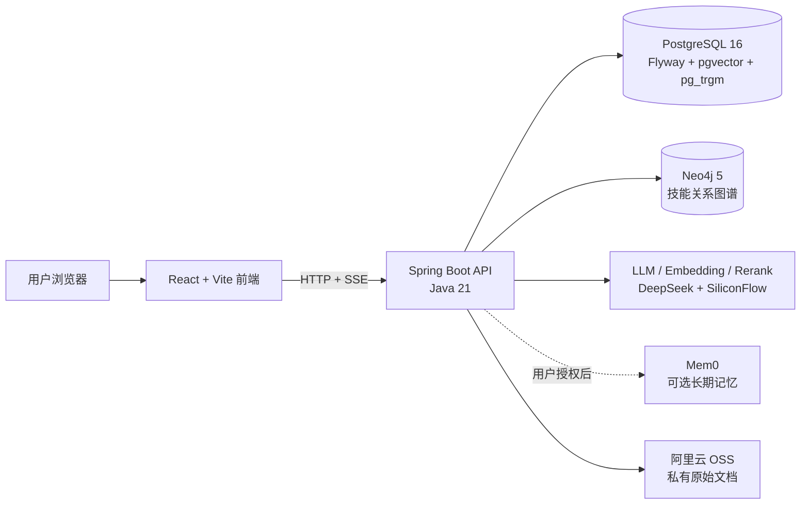
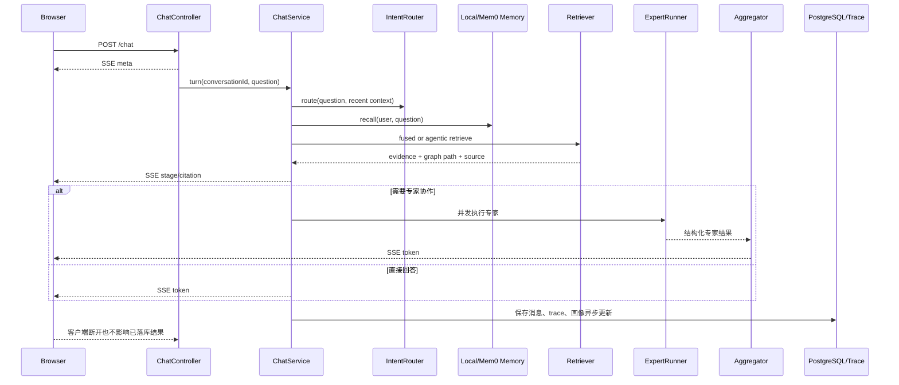

# 项目架构

## 1. 项目目标

项目面向个人求职和学习场景，将以下链路串成闭环：

```text
目标岗位 / 用户问题
        ↓
意图路由与用户上下文
        ↓
向量 + 关键词 + 图谱检索
        ↓
专家并发 / 直接回答 / 多跳检索
        ↓
结果仲裁、引用和 SSE 输出
        ↓
画像更新、学习任务、岗位推送和评测留痕
```

核心工程目标不是让 LLM 自由调用更多工具，而是让每次调用都具备明确的 Query 类型、有限候选范围、可解释证据、故障边界和可回归指标。

## 2. 组件关系



| 组件 | 职责 | 失败时的处理 |
| --- | --- | --- |
| React/Vite | 页面、SSE 消费、评测可视化、管理员操作 | 展示用户友好错误，不暴露堆栈 |
| Spring Boot | 认证、会话、Agent 编排、业务 API | 按模块超时、降级并记录 trace |
| PostgreSQL | 业务数据、会话、任务、文档分块、向量和评测结果 | 主业务依赖，未就绪时 `/readyz` 返回 503 |
| Neo4j | 技能前置关系和有限图扩展 | 熔断后返回安全空结果，主流程继续 |
| LLM 服务 | 路由、总结、专家回答、Embedding、Rerank | 超时/失败时按调用目的回退 |
| Mem0 | 可选跨会话长期记忆 | 本地 Episode 记忆兜底，不阻断聊天 |
| OSS | 知识库原始文件 | 上传失败不写入成功状态，处理失败可重试 |

## 3. 聊天请求时序



当前 SSE 事件包括：`meta`、`stage`、`clarify`、`citation`、`token`、`done`、`error`。Token 携带 `seq`，引用携带 `sid`，前端据此进行顺序拼接和证据展示。

## 4. 检索架构

### 4.1 查询类型

对话意图使用有限枚举：`resume`、`interview`、`planning`、`mixed`、`chat`、`out_of_scope`。

检索器还会根据 Query 内容判断是否属于资源推荐或学习路径问题：

- 资源推荐：向量、pg_trgm、图扩展，必要时二阶段重排；
- 学习路径：启用 Agentic 多跳检索；
- 普通问题：优先单跳检索；
- 越界问题：跳过不必要的 embedding 和专家调用。

### 4.2 混合检索

```text
Query
 ├─ pgvector：向量 Top20
 ├─ pg_trgm：稀疏 Top20
 └─ Neo4j：向量前10节点的一跳扩展
       ├─ 关系白名单
       ├─ 每源节点配额
       └─ 总候选数上限
          ↓
      RRF 融合 + 图扩展衰减 + 候选去重
          ↓
      资源推荐 Query 才进入 Rerank
          ↓
      TopK Evidence
```

当前实现的关键限制包括：

- RRF `K=10`；
- 向量候选上限 20；
- 仅对向量前 10 个节点做图扩展；
- 单源扩展配额 6，总扩展上限 40；
- 图扩展贡献使用 `ALPHA=0.85`；
- 稀疏通道使用 `BETA=0.3`；
- 资源 Query 对非资源节点的扩展贡献进行抑制。

这些数值是当前实现的实验性配置，应通过评测集重新校准，不代表所有数据规模下的最优值。

### 4.3 受控多跳检索

多跳检索最多 3 跳。每跳会：

1. 使用当前 Query 走融合检索；
2. 按节点 ID 去重并累计证据；
3. 对第 2、3 跳应用分数衰减；
4. 由 LLM 判断证据是否充分，必要时生成下一跳 Query；
5. LLM 输出无效或失败时使用固定 Query 收窄策略。

LLM 不能直接执行任意图查询。跳数、候选规模、关系范围和最终 TopK 都由服务端控制。

## 5. 记忆、文档和业务闭环

### 记忆

- 本地 Episode 记忆：默认可用，保存可控的会话摘要和情节信息；
- Mem0：默认关闭，必须用户授权，调用超时或熔断后回退本地；
- 删除记忆：删除本地用户记忆，并尝试删除远端用户记忆；远端删除失败会明确提示。

### 文档

```text
管理员上传
   ↓
OSS 保存原文件 + PostgreSQL 保存元数据
   ↓
异步解析 PDF / DOCX / TXT / Markdown
   ↓
切分（800 字符，120 重叠）
   ↓
Embedding
   ↓
knowledge_document_chunks
   ↓
状态 indexed 后加入向量检索
```

原文件不进入 PostgreSQL；PostgreSQL 只保存元数据、处理状态、分块和 embedding。

### 岗位到学习任务

岗位要求与用户画像先进行技能对齐，再结合图谱前置关系生成任务。任务需要绑定学习目标和完成证据，例如代码、测验或面试验证，并通过幂等约束避免重复推送。

